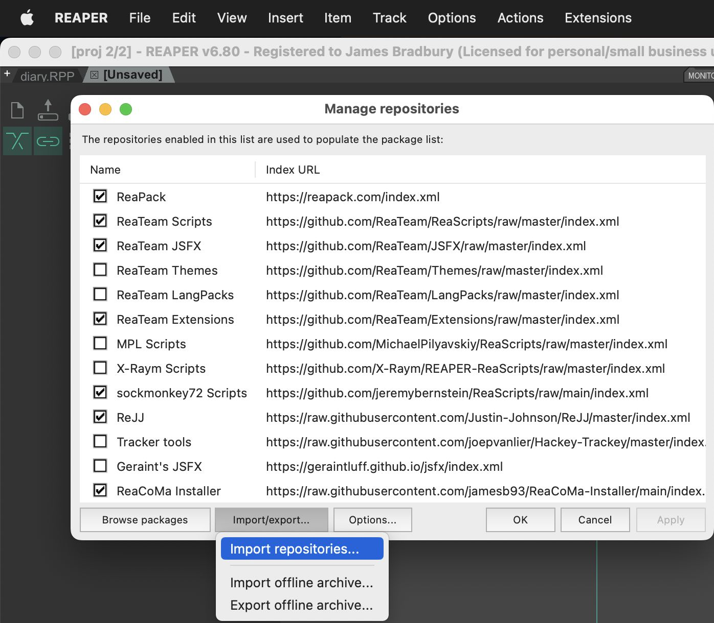

# ReaCoMa Installer

This repository is a ReaPack compatible package (or workable on its own) that provides a script for installing and updating ReaCoMa.

## Guide
Follow this step-by-step guide to get going with ReaCoMa Installer.

### Manage Repositories
The first step is to open the repository manager in ReaPack. You can do this by opening `Extensions > ReaPack > Manage repositories...`.

### Import ReaCoMa Installer
You then need to add a custom ReaPack repository. To do this you need to click the `Import/export...` button and then click `import repositories...`.

Once you've done this you need to paste `https://raw.githubusercontent.com/jamesb93/ReaCoMa-Installer/main/index.xml` and click `OK`.

### Synchronise Packages
Then, synchronise ReaPack packages. This makes sure that it is up to date with the new repository you just added.

### Install ReaCoMa Installer Script
Lastly, from the "Browse Packages" area of ReaPack, search for *reacoma* and you should see the ReaCoMa Installer script.

Right click and install ReaCoMa Installer, hit apply, and then follow the successive promots.

To run the script, you can search for the script which is automatically registered as an "action" and run the action by pressing "Run".

That's it! 🎉🎉🎉

ReaCoMa should now be installed and a set of new actions will be registered for each of the ReaCoMa scripts.

